**Hướng dẫn: clone hoặc tải src code về sau đó open project với Netbeans**
# 1. Giao diện chính

## Đăng nhập
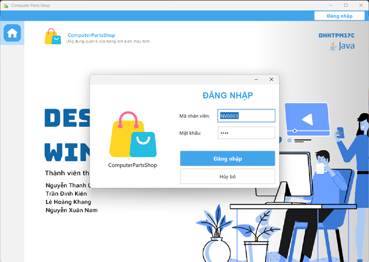
# 2. Tạo hóa đơn
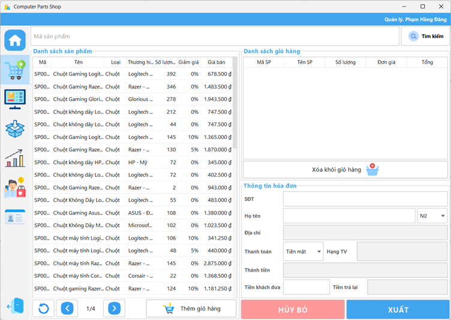
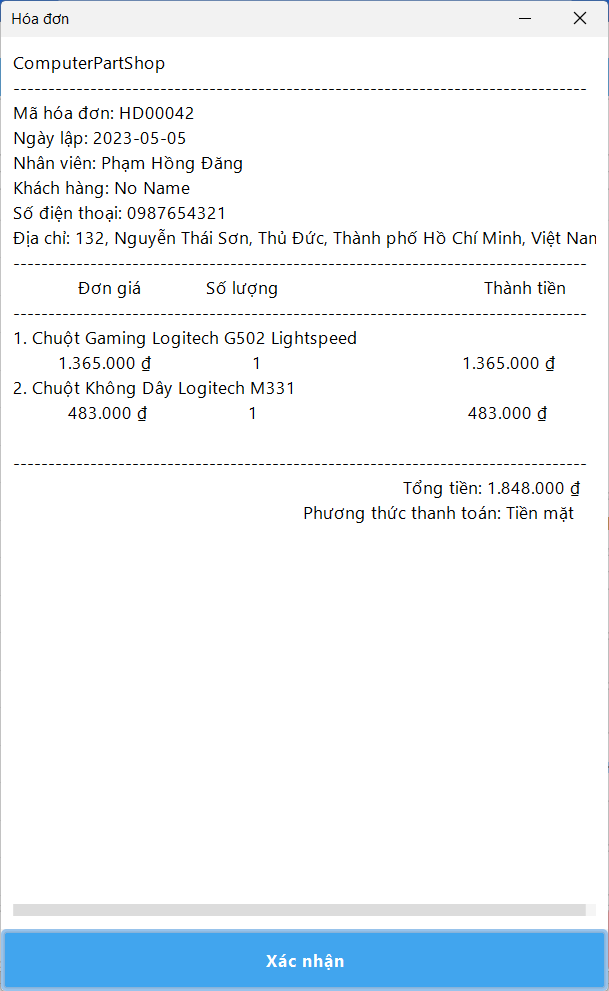
# 3. Tìm kiếm, quản lí sản phẩm
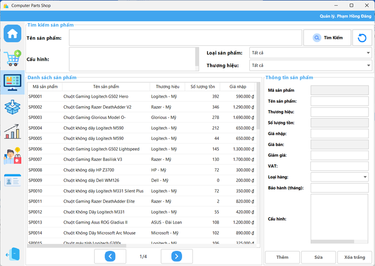
# 4. Quản lí đơn hàng
## Tạo đơn nhập
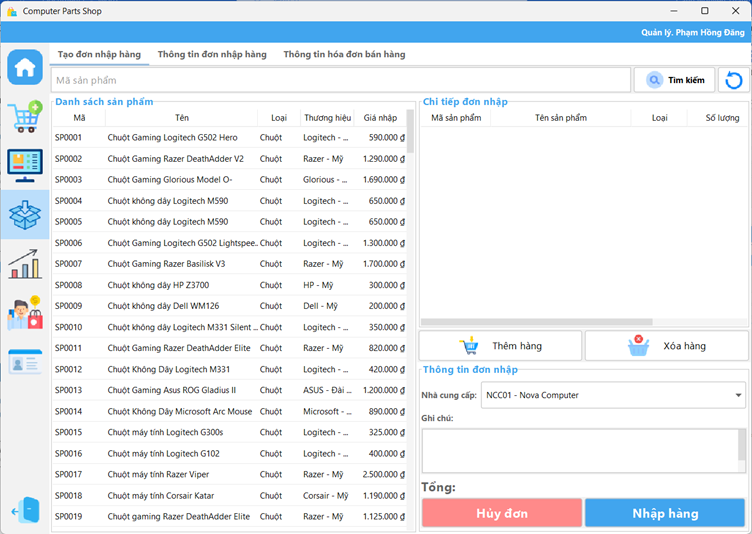
## Quản lí đơn nhập
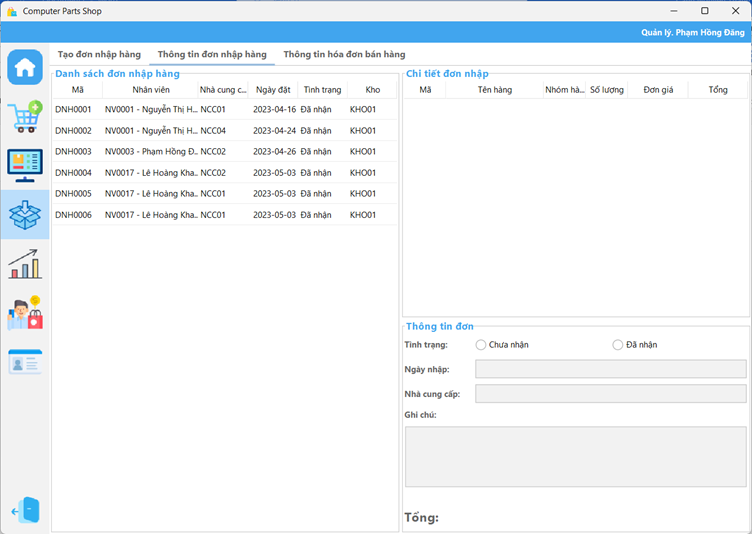
## Quản lí hóa đơn bán hàng
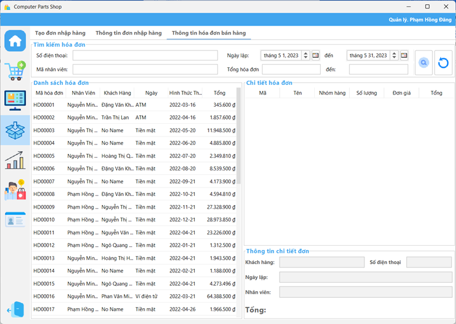
# 5. Thống kê
## Thống kê sản phẩm
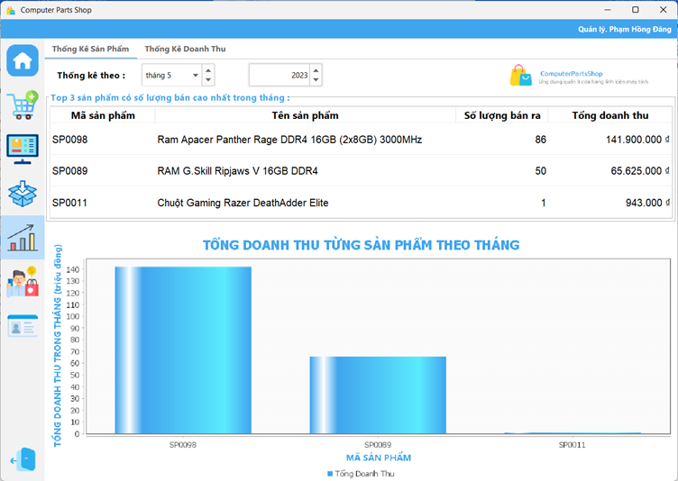
## Thống kê doanh thu
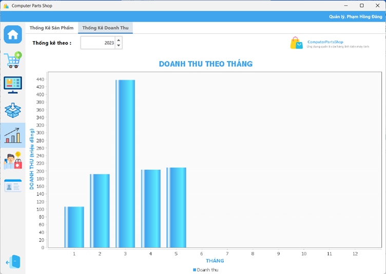
# 6. Quản lí khách hàng
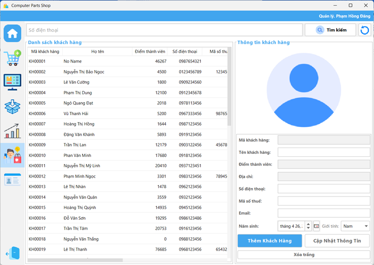
# 7. Quản lí nhân viên
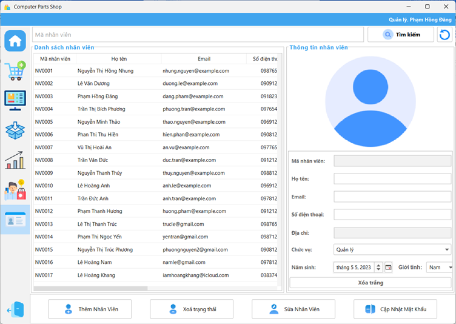